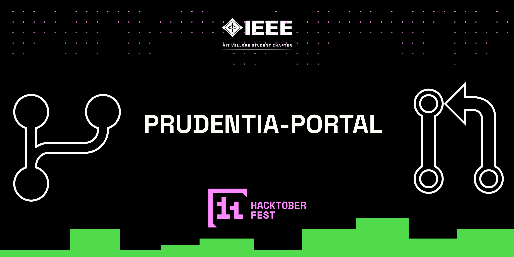

# Prudentia 2024 Portal

## About
Prudentia 2024 Portal is IEEE-VIT's portal for its hackathon Prudentia. The portal contains interactive 3D graphics, details related to the hackathon as well as a portal for participants to submit their work at the end of every round.

## Hacktoberfest 2024 with IEEE-VIT
What is Hacktoberfest 2024? HacktoberFest 2024 is the 11th edition of Hacktoberfest hosted by DigitalOcean. It is an open source festival celebrated during October every year, encouraging people worldwide to actively participate and contribute to participating open source projects hosted across GitHub and GitLab.

## Tech Stack

- React.js
- Three.js
- React Three Fiber
- React Three Drei
- Email JS
- Vite
- Tailwind CSS

## Prerequisites

Make sure you have the following installed on your machine:

- [Git](https://git-scm.com/)
- [Node.js](https://nodejs.org/en)
- [npm](https://www.npmjs.com/) (Node Package Manager)

Disclaimer: Vite requires Node.js version 18+. 20+. However, some templates require a higher Node.js version to work, please upgrade if your package manager warns about it.

Hint:Manually install the latest Node.js version for Windows or use nvm to install the latest version on Mac/Linux.

## Cloning the Repository
```bash
git clone https://github.com/IEEE-VIT/Prudentia-2024-Portal.git
cd prudentia-2024-portal
```

## Installation

```bash
npm install --legacy-peer-deps
```
On proper installation you should see a new directory called node_modules in your root folder.

## Setting Up Environment Variables(Optional)

Do the following steps only if you plan on using the EmailJS features of the portal.
Create a new file named `.env` in the root of your project and add the following content:

```env
REACT_APP_EMAILJS_USERID=your_emailjs_user_id
REACT_APP_EMAILJS_TEMPLATEID=your_emailjs_template_id
REACT_APP_EMAILJS_RECEIVERID=your_emailjs_receiver_id
```
Replace the placeholder values with your actual EmailJS credentials. You can obtain these credentials by signing up on the [EmailJS website](https://www.emailjs.com/).

## Running the Project

```bash
npm run dev
```
Ctrl+click on the link that shows up in your terminal on running this command to view your build.

## Deploying the project

Once development is complete in order to deploy your project use the following command to build an optimized version of your project ready for deploying.

```bash
npm run build
```
This will generate a new directory called dist which will contain all the files from your project for deploying.

## Contribution

Do Check [CONTRIBUTING.md](CONTRIBUTING.md) to know proper contribution guidelines.
